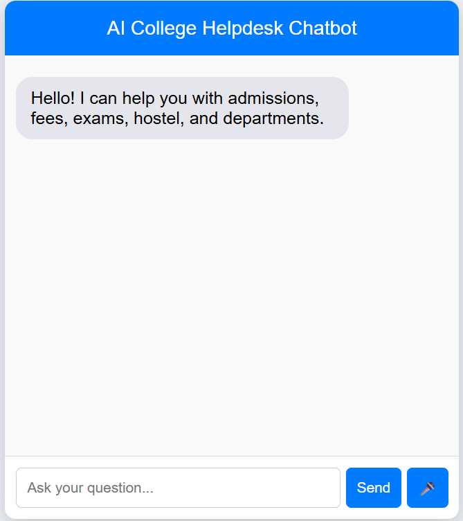
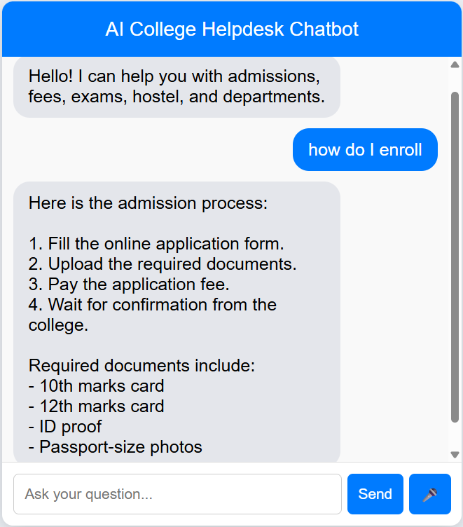
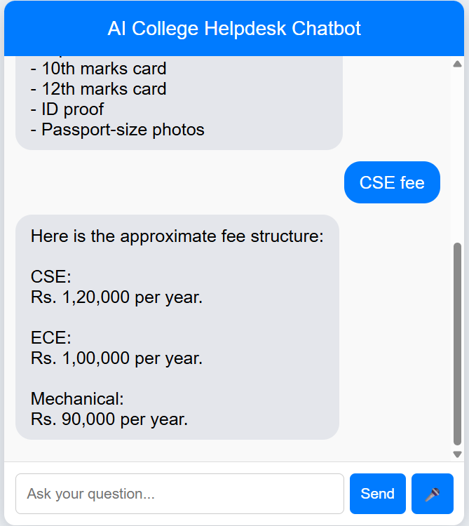

# 🤖 AI-College-Chatbot

An intelligent college helpdesk chatbot built using Flask and basic Natural Language Processing (NLP). This chatbot helps users get information about admissions, fees, exams, departments, hostel facilities, and more through a simple conversational interface.

---

## 🚀 Features

- 💬 Interactive chatbot interface  
- 🧠 Basic NLP using keyword + similarity matching  
- 🎯 Intent-based response system  
- ⚠️ Smart fallback for unknown or unclear queries  
- 📚 Covers multiple college-related queries (admissions, fees, hostel, etc.)  
- 🌐 Web-based UI built using Flask  

---

## 🛠️ Technologies Used

- Python  
- Flask  
- Scikit-learn  
- HTML, CSS, JavaScript  

---

## 📂 Project Structure

```
ai-college-chatbot/
│
├── app.py
├── intents.json
├── requirements.txt
├── Procfile
│
├── templates/
│   └── index.html
│
├── static/
│   └── images/
│       ├── home.png
│       ├── admission.png
│       ├── fees.png
│       ├── hostel.png
│       └── fallback.png
```
---

## ▶️ How to Run Locally

1. Clone the repository:git clone https://github.com/suhani05-poojary/ai-college-chatbot.git⁠�
2. Navigate to project folder:cd ai-college-chatbot
3. Install dependencies:pip install -r requirements.txt
4. Run the application:python app.py
5. Open in browser:http://127.0.0.1:5000

---

## 📸 Screenshots

### 🏠 Home Screen


---

### 🎓 Admission Query


---

### 💰 Fee Details


---

### 🏠 Hostel Information


---

### ⚠️ Fallback Handling


---

## ⚠️ Limitations

- May not handle complex or multi-intent queries perfectly  
- Depends on predefined intents and patterns  
- Not connected to real-time college database  

---

## 🔮 Future Improvements

- Integrate real NLP models (like transformer-based models)  
- Add database support for dynamic responses  
- Improve intent detection accuracy  
- Add voice input/output features  
- Deploy with scalable backend  

---

## 🌐 Deployment

This project can be deployed on cloud platforms like Render for public access.

---

## 🙌 Author

- Suhani Poojary
